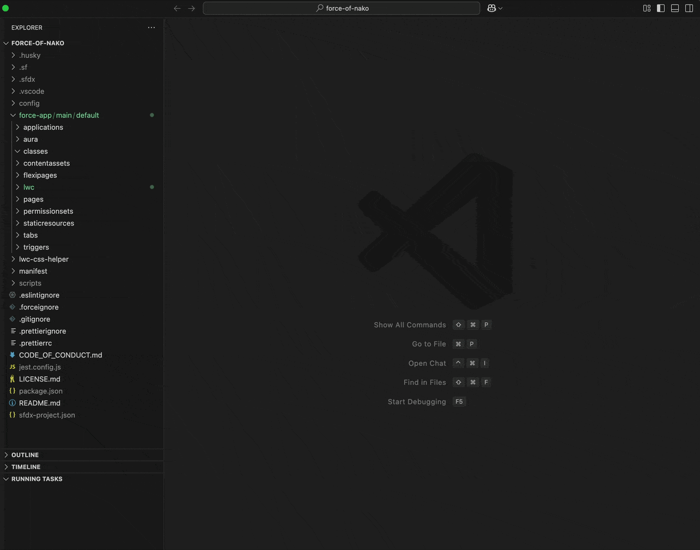

# NAKODX: Retrieve File from Server

**NAKODX: Retrieve File from Server** is a Visual Studio Code extension designed for Salesforce developers to quickly and easily retrieve metadata files directly from a Salesforce org.

---

## Features

### Retrieve Salesforce Metadata Quickly
- Use the command `NAKODX: Retrieve File from Server` to rapidly select and download any metadata type (e.g., `ApexClass`, `LightningComponentBundle`) directly from your Salesforce org.
- The extension provides an intuitive interface where you can start typing the metadata type or item name to quickly filter the results.

### Caching for Performance (Optional)
- Metadata types and their items are (optionally) cached per Salesforce org for faster subsequent retrievals. You can disable caching or tune its retention period in settings (see Configuration below).

### Cache Management
- When caching is enabled, the extension adds commands to clear cached data for the current org:
  - **Clear Types Cache:** `NAKODX: Retrieve File from Server - Clear Types Cache`
  - **Clear Items Cache:** `NAKODX: Retrieve File from Server - Clear Items Cache`

Disabling caching in settings instantly removes all in-memory and on-disk cache files and hides the above cache-clearing commands from the Command Palette.

---

## Usage

1. Open the command palette (`Cmd+Shift+P` on macOS or `Ctrl+Shift+P` on Windows).
2. Start typing `NAKODX: Retrieve File from Server` and select it.
3. Choose the metadata type from the presented list or start typing to filter quickly.
4. After selecting the metadata type, choose the specific metadata item from the presented list.

The selected metadata file will be downloaded and opened in your workspace automatically.

---

## Commands

| Command Name                                          | Description                                       |
|-------------------------------------------------------|---------------------------------------------------|
| `NAKODX: Retrieve File from Server`                   | Retrieve metadata file from Salesforce server.    |
| `NAKODX: Retrieve File from Server - Clear Types Cache`| Clears the cached metadata types for the current org.|
| `NAKODX: Retrieve File from Server - Clear Items Cache`| Clears the cached metadata items for the current org.|

---

## Requirements

- Salesforce CLI (sf) installed and configured.
- VSCode.

---

## Support and Feedback
---

## Configuration

Open VS Code Settings (UI or settings.json) and search for "NAKODX File Retriever".

| Setting | Key | Default | Range | Description |
|---------|-----|---------|-------|-------------|
| Auto Open After Download | `nakodx-file-retriever.autoOpenAfterDownload` | `true` | n/a | Automatically opens the first retrieved file (non `-meta.xml` if present). |
| Enable Cache | `nakodx-file-retriever.enableCache` | `true` | n/a | Toggles all metadata caching. When set to `false`, all existing cache files are immediately deleted and cache clear commands are hidden. |
| Cache TTL (Days) | `nakodx-file-retriever.cacheTtlDays` | `30` | `1–30` | Number of days cached metadata remains valid. Older entries are refetched on demand. |

Notes:
- Changing TTL or toggling caching takes effect immediately; no reload needed.
- If you frequently switch orgs or need always-fresh lists, disable caching.

For issues, feedback, or feature requests, please open an issue on the project's repository.